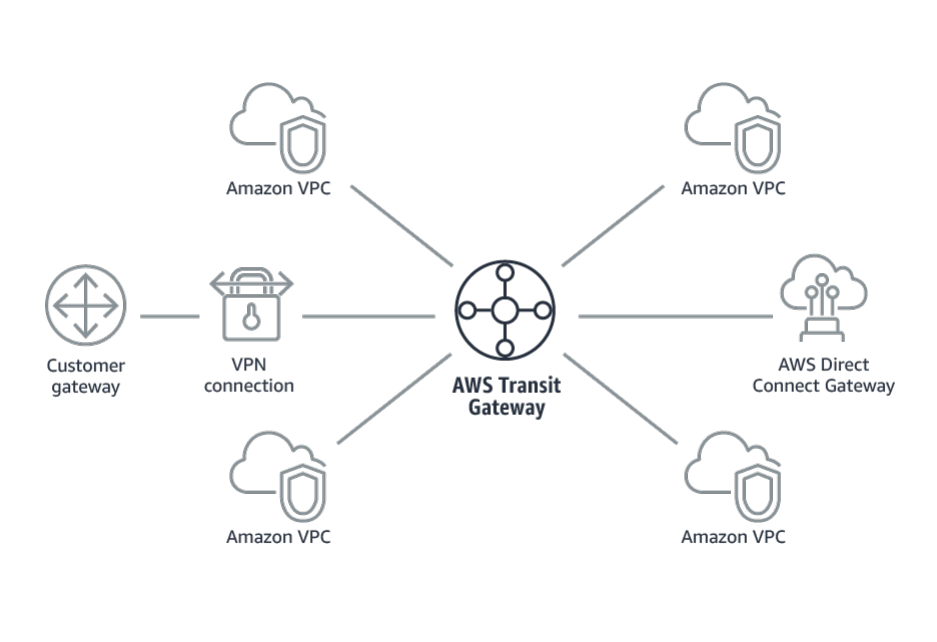
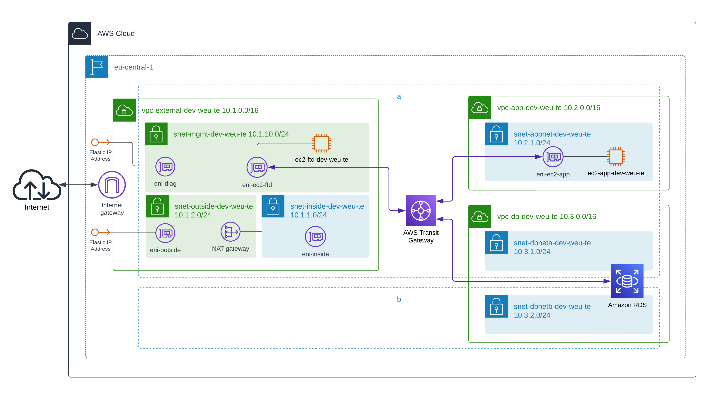

# Open Session 3

### Description 
Deploy infrastructure for a centralized firewall deployment model in Azure and AWS.
### One Translation of Azure Hub-Spoke Model in AWS

### Example Architecture for AWS
