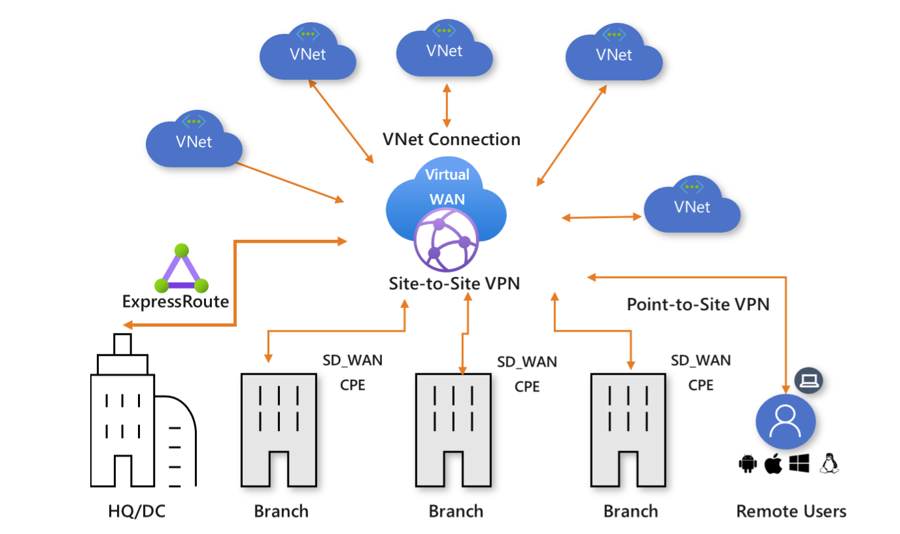
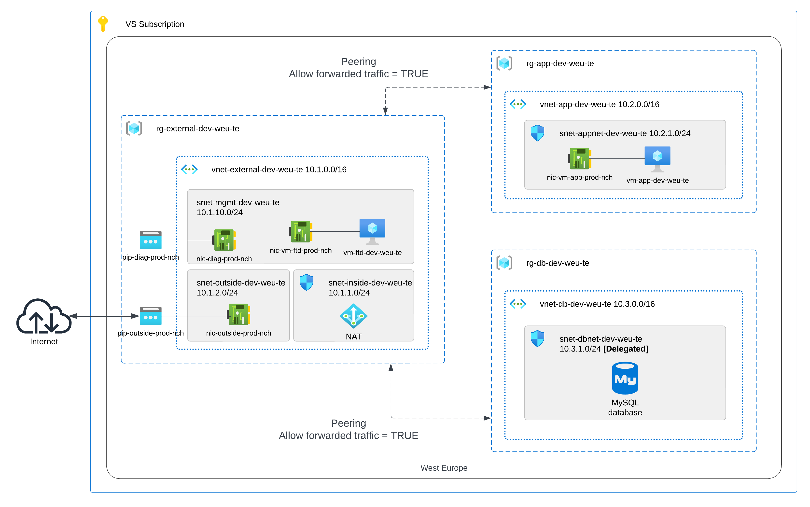

# Open Session 3

### Description 
Deploy infrastructure for a centralized firewall deployment model in Azure and AWS.
### One translation of AWS Transit Gateway in Azure

### Example Architecture for Azure

